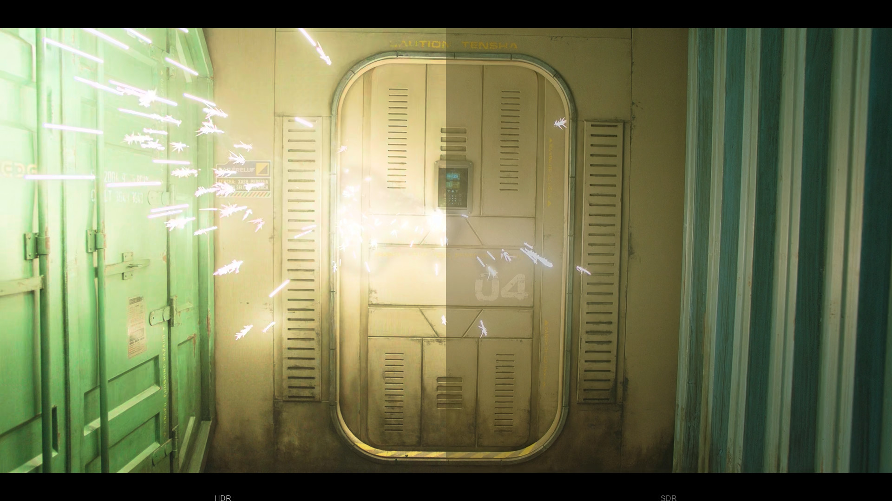
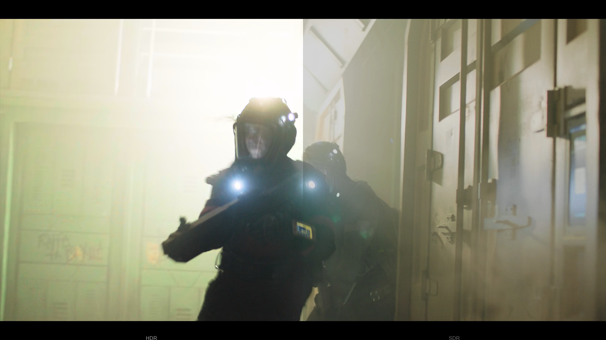
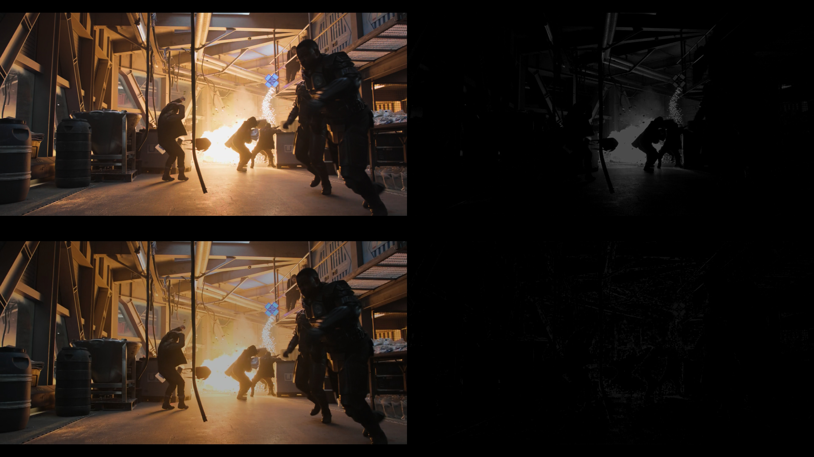
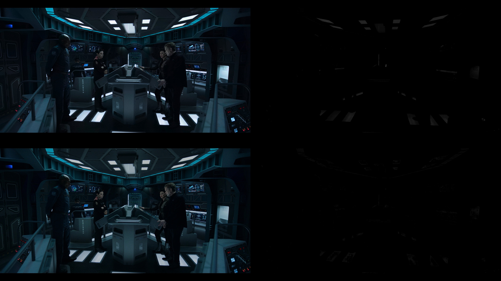

# HDRCompare: compare SDR and HDR video files
*Brought to you by [Etienne Dechamps][] - [GitHub][]*

<a href="The-Expanse-S06E04-2941-compare.jpg"></a>
<a href="The-Expanse-S06E04-3053-compare.jpg"></a>
<a href="The-Expanse-S06E04-0036-diff.jpg"></a>
<a href="The-Expanse-S06E04-0839-diff.jpg"></a>

## Description

HDRCompare is a suite of [ffmpeg/libavfilter filters][lavfi] for comparing
the SDR and HDR versions of otherwise identical video material. It is useful to
determine how well HDR is used in various movie releases, for example.

The basic idea is to take the SDR video and then convert it to HDR, *without*
expansion (i.e. preserving the original color and luminance), and then show it
side by side with the HDR video, allowing for an easy and fair comparison.

The following filter chains are provided:

- `hdr-compare.lavfi` presents the left half of the HDR video on the right side,
  and the right half of the SDR video on the right side. Every second, the two
  sides switch places.
- `hdr-diff.lavfi` divides the display in 4 quadrants:
  - Upper left: original HDR video
  - Lower left: original SDR video
  - Upper right: extra luminance in the HDR video
  - Lower right: extra saturation in the HDR video

`hdr-compare` is useful to get an overall feel of the difference between HDR and
SDR across entire scenes. `hdr-diff` is useful to detect and surface any local
differences.

## Limitations

- This is a quickly-thrown-together toy, not a tool designed for serious use. Do
  not expect it to be accurate. No effort was spent fine-tuning various
  parameters. The SDR to HDR colorspace conversion, in particular, is dubious at
  best.
  - A more serious attempt would use a proper CMS to do the gamut mapping from
    SDR to HDR, and would likely leverage a DeltaE formula or similar to
    highlight the differences in a perceptually accurate manner.
- The SDR and HDR input videos must be as identical as possible (aside from the
  colorspace difference, obviously).
  - This is especially important for `hdr-diff`, which will behave very poorly
    if the input is not frame-by-frame synchronized or has the slightest
    difference in cropping.
  - They can be different sizes though. Typically, HDR files are 2160p while
    SDR files are 1080p. We want to focus purely on colour differences, so the
    filters will always scale both streams to 1080p for a fair comparison.
- The filters assume the HDR input is HDR10 (i.e. BT.2020+PQ). Dolby Vision and
  HLG are not supported.
- HDR metadata (i.e. peak luminance/maxCLL information) is not preserved, so the
  HDR tone mapping is unlikely to be optimal.
  - This can be work around by manually specifying the metadata after the
    filter, but note that [mpv won't pass the metadata through][mpv10129] to the
    display, in any case.
- The filters are expensive to compute. On a good PC `hdr-compare` can typically
  run in real time. `hdr-diff` typically won't, though it will come close.

## How to use

You can apply the filter in real time using any player that is capable of
applying a libavfilter filter chain. [mpv][] is the most obvious choice and it's
what the filters were developed with.

Here's an example mpv command line using Powershell:

```powershell
mpv `
    --lavfi-complex="$((Get-Content -Path .\hdr-compare.lavfi) -notmatch '^\s*#')" `
    --vf=format=colormatrix=bt.2020-ncl:colorlevels=limited:primaries=bt.2020:gamma=pq `
    <PATH TO HDR FILE> --external-file=<PATH TO SDR FILE>
```

**Note:** SDR uses relative luminance, but HDR uses absolute luminance. For this
reason it is fundamentally difficult to ensure that both are presented at the
same average brightness level. Currently the filter maps 100% SDR level to 150
nits in HDR. This is mostly arbitrary and will likely be slightly off for most
content. If you observe that the HDR side is brighter overall than the SDR side
(or vice-versa), search for the `npl=` parameter in the relevant `.lavfi` file
to adjust the brightness of the SDR side. Note that you might find that
even different scenes of a single movie might call for a different value.

[Etienne Dechamps]: mailto:etienne@edechamps.fr
[GitHub]: https://github.com/dechamps/HDRCompare
[lavfi]: https://ffmpeg.org/ffmpeg-filters.html
[mpv]: https://mpv.io/
[mpv10129]: https://github.com/mpv-player/mpv/issues/10129
